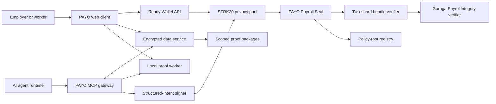
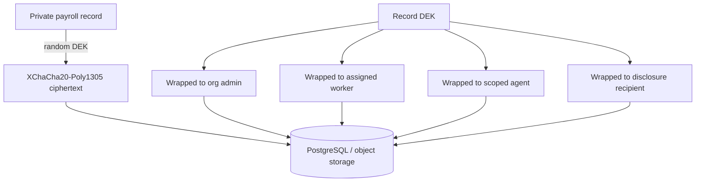
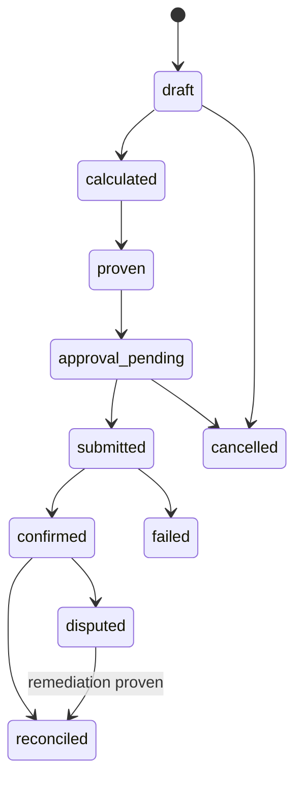

# PAYO Architecture

This document is the normative technical design for PAYO. The README describes the product and current status; this file defines component responsibilities, trust boundaries, public interfaces, proof semantics, and failure behavior.

## 1. Design principles

1. **Non-custodial settlement.** PAYO contracts never hold the payroll treasury. STRK20 owns private note settlement and users authorize transactions from their own accounts.
2. **Encrypted before storage.** Sensitive payroll fields leave an authorized client only as authenticated ciphertext.
3. **Proof states are specific.** A calculation proof, a Starknet receipt, and a settlement-reconciliation proof are different evidence.
4. **Private does not mean unaccountable.** Every private run has a scoped receipt path for the employer, each worker, and explicitly authorized reviewers.
5. **Agents receive capabilities, not treasury keys.** An MCP client cannot request arbitrary signing.
6. **No silent downgrade.** Unsupported tokens, proof versions, wallet APIs, and policy roots fail closed with an explicit state.

## 2. System context



### Component responsibilities

| Component | Responsibility | Must not do |
|---|---|---|
| Web client | Decrypt, calculate, prove, compose wallet actions | Upload plaintext payroll |
| Ready | Hold human STRK20 keys and request approval | Reveal a recovery phrase or viewing key to PAYO |
| Encrypted data service | Authorize tenants and store ciphertext/workflow metadata | Decrypt sensitive records |
| Proof worker | Generate PayrollIntegrity and later SettlementMatch proofs | Log private witnesses |
| MCP gateway | Offer structured payroll tools and redact responses | Expose arbitrary calls or keys |
| Structured-intent signer | Rebuild and validate permitted agent actions | Sign caller-supplied arbitrary calldata |
| STRK20 | Private notes, channels, proving, and settlement | Enforce PAYO employment policy |
| Payroll Seal | Verify proof state and prevent replay | Custody payroll assets |
| Bundle verifier | Verify both linked shards with one proof-bound Garaga verifier | Accept a missing, duplicated, or reordered shard |

## 3. Trust and leakage boundaries

### Hidden by design

- worker and agent identity;
- recipient Starknet address;
- salary, deductions, benefits, severance, and token preference;
- agreement type, jurisdiction, and classification evidence;
- individual schedule and vesting parameters;
- plaintext accounting exports.

### Public or observable

- transaction submitter unless a paymaster/relay hides it;
- interaction with the STRK20 pool and PAYO contract;
- transaction timing and calldata size;
- verifier and policy-catalog versions;
- commitment roots, run nullifier, and proof status;
- explicitly disclosed aggregate values.

Commitments do not make low-entropy values secret by themselves. Every sensitive leaf includes a cryptographically random 32-byte salt before hashing.

## 4. Client-encrypted vault

Each sensitive record receives a random 256-bit data-encryption key (DEK). The record is encrypted with XChaCha20-Poly1305 and the DEK is sealed independently to each authorized X25519 principal.



Associated data binds `schema_version`, `organization_id`, `record_type`, `record_id`, and `revision`. Moving ciphertext between tenants or revisions therefore fails authentication.

The service may see operational metadata needed to schedule and synchronize work: tenant ID, opaque record ID, revision, encrypted payload size, state, due timestamp, roots, and transaction references. It must never receive a plaintext pay line.

### Recovery

Vault creation produces an encrypted recovery package. An organization must either download it or wrap the organization key to a second administrator before production use. PAYO cannot reset a lost vault key.

## 5. Domain model

### Primary records

- `Organization`: tenant configuration, vault public keys, supported token policy.
- `Principal`: human, worker, agent, auditor, or signer identity.
- `Payee`: encrypted identity and payout details.
- `PayAgreement`: encrypted obligation terms and policy references.
- `PolicyPack`: public versioned rules plus a commitment included in a catalog root.
- `PayrollRun`: cycle, encrypted manifest, roots, proof and settlement states.
- `PayrollLine`: encrypted private witness for one agreement obligation.
- `ProofBundle`: proof bytes, public inputs, verifier version, and verification receipt.
- `Settlement`: wallet request ID, transaction hash, confirmation, note-evidence state.
- `DisclosureGrant`: field scope, recipient encryption key, expiry, and revocation.
- `AgentCapability`: signed structured authority for MCP execution.
- `AuditEvent`: append-only operational evidence without private field values.

Use UUIDv7 identifiers offchain. Amounts are base-10 atomic-unit strings and are never JavaScript floating-point numbers.

### Payroll state machine



- `proven` means PayrollIntegrity verified.
- `confirmed` means Starknet accepted the STRK20 transaction.
- `reconciled` means SettlementMatch verified or an explicitly labeled authorized disclosure reconciled the notes.

## 6. Token model

| Token | Mainnet address | Decimals | Fee behavior |
|---|---|---:|---|
| STRK | `0x04718f5a0fc34cc1af16a1cdee98ffb20c31f5cd61d6ab07201858f4287c938d` | 18 | PAYO reads the pool fee passively; Ready constructs and deducts the final private fee when it submits the Wallet API request |
| Native USDC | `0x033068f6539f8e6e6b131e6b2b814e6c34a5224bc66947c47dab9dfee93b35fb` | 6 | PAYO converts the live pool fee using the paymaster's current token price and an explicit conservative buffer; Ready constructs the final deduction |

Native USDC is enabled because the live Ready/pool compatibility test and its on-chain evidence pass. The application never substitutes bridged USDC silently.

A payroll may mix STRK and USDC lines. Treasury validation groups totals and passive fee reserves by token and fails closed if any active token lacks sufficient shielded balance. PAYO does not call `wallet_strk20PrepareInvoke` merely to preview a fee before later calling `wallet_strk20InvokeTransaction`; that created a second wallet request without producing a submittable transaction. The final Wallet API request remains responsible for constructing and submitting the private transaction. Receipt-reported Starknet gas and Ready's token-denominated privacy-fee recovery are separate evidence and must not be collapsed into one guessed public-STRK debit.

## 7. Commitments and nullifiers

Externally disclosed v1 identity, policy-ID, receipt, and nullifier commitments use canonical byte encoding and Keccak-256. PayrollIntegrity additionally derives circuit-internal agreement leaves, payroll leaves, and fixed-tree nodes with a domain-separated BN254 Poseidon2 sponge. This proof-root layer is reproduced byte-for-byte by the browser input builder and exists to keep the 64-leaf circuit provable with the Starknet-compatible backend; it never replaces a disclosed v1 commitment silently.

```text
leaf = keccak256(
  "PAYO_LEAF_V1" ||
  schema_version ||
  keccak256("PAYO_AGREEMENT_ID_V1" || agreement_id) ||
  recipient_commitment ||
  gross_atomic ||
  deductions_commitment ||
  net_atomic ||
  token_address ||
  policy_commitment ||
  schedule_commitment ||
  salt_32
)
```

Both proof trees are fixed at 64 leaves and permit no more than 50 real leaves. Circuit-internal empty leaves use a versioned Poseidon2 constant. A canonical Keccak run nullifier prevents replay:

```text
run_nullifier = keccak256(
  "PAYO_RUN_V1" || organization_secret || cycle_id || revision
)
```

Hash and proof-root values crossing into Cairo are represented as two big-endian `u128` limbs. Keccak commitment vectors remain mandatory for TypeScript, Noir, and Cairo; proof-root Poseidon2 vectors are mandatory for TypeScript and Noir because Cairo consumes, but does not recompute, those roots.

## 8. PayrollIntegrity proof

### Public inputs

The deployment-bound `v1` circuit uses two linked proofs against the same circuit and verification key. Each shard exposes exactly 17 fields:

- chain ID, Payroll Seal address, proof version, and schema version;
- authoritative agreement, payroll-manifest, policy-catalog, and FX-snapshot roots, each as two big-endian `u128` limbs;
- a circuit-derived run nullifier as two limbs; and
- validity start and expiry, with a maximum one-hour window; and
- a shard index, required to be `0` for the first proof and `1` for the second.

The first 16 public inputs must be identical across both proofs. Shard 0 authenticates agreement leaves 0–25 and payroll leaves 0–24; shard 1 authenticates agreement leaves 24–49 and payroll leaves 25–49. The agreement overlap binds the private global sorting boundary. `PayoPayrollSeal` accepts only the ordered 34-input bundle, so neither shard is independently sufficient to mark a run proven.

The agreement root is not a list of opaque IDs. Each leaf canonically commits the agreement ID commitment, recipient commitment, earnings components, token, compiled policy commitment, schedule, due/expiry timestamps, classification inputs, final-pay requirements, FX floor/currency, and a random agreement salt. The circuit recomputes these leaves and requires each due payroll line to equal its authoritative private terms.

### Private witness

- both fixed 64-leaf agreement and payroll arrays;
- 26 overlapping agreement witnesses and 25 payroll lines per shard;
- recipient commitments and salts;
- earnings, deductions, and net atomic amounts;
- selected token and token decimals;
- classification answers and treatment;
- schedule, milestone, vesting, or termination inputs;
- selected policy instructions and catalog paths;
- FX selection and target-value floor.

### Assertions

1. Every active due agreement appears exactly once.
2. Agreement identifiers are unique and sorted before padding; the one-to-one line mapping derives line uniqueness.
3. Earnings components sum to gross.
4. The bounded policy program produces committed deductions.
5. Net equals gross minus deductions and is non-negative.
6. Classification treatment matches the selected reference rule.
7. Token decimals and atomic conversion are exact.
8. Oracle value meets the committed reference-currency floor.
9. Schedule or vesting conditions are due at the validity timestamp.
10. Final-pay mode includes every committed offboarding component.

The first policy DSL supports `CONST`, `INPUT`, `ADD`, `SUB`, `MUL_DIV`, `MIN`, `MAX`, and fixed-size progressive `BRACKET` instructions. Packs are bounded and padded so policy complexity does not reveal the selected jurisdiction.

`ClassificationConsistency` proves internal consistency. It cannot establish legal worker status, which depends on real-world facts outside the circuit.

## 9. SettlementMatch proof

SettlementMatch is a separate proof because a correct payroll calculation does not itself prove that the corresponding private notes were transferred.

The proof consumes, privately:

- the approved manifest leaves;
- a locally controlled STRK20 viewing key;
- decrypted sent-note data;
- note/channel witnesses required to reproduce public commitments.

It exposes only the run nullifier, manifest root, transaction reference, settlement root, and proof version.

Ready does not currently expose its viewing key through the dapp Wallet API. Ready-backed payroll must therefore stop at `confirmed`, never falsely report `reconciled`, until a compatible receipt/disclosure capability exists. Direct Privacy SDK policy accounts can implement SettlementMatch because their operator controls the viewing-key provider.

## 10. Starknet contracts

### PayoPayrollSeal

The STRK20 pool calls `privacy_invoke`. The contract accepts a mode and proof payload and returns an empty `Span<OpenNoteDeposit>` because it does not custody or transform tokens.

```text
privacy_invoke(
  mode,
  proof_version,
  schema_version,
  agreement_root_high,
  agreement_root_low,
  manifest_root_high,
  manifest_root_low,
  policy_root_high,
  policy_root_low,
  fx_root_high,
  fx_root_low,
  run_nullifier_high,
  run_nullifier_low,
  validity_start,
  validity_expiry,
  shard_0_proof_calldata[]
  shard_1_proof_calldata[]
)
```

Modes:

- `PRECOMMIT`: verify PayrollIntegrity and consume the run nullifier.
- `FINALIZE`: attach SettlementMatch to an existing run.
- `CLAIM`: record a private correctness claim.
- `REMEDIATE`: bind a supplemental private settlement to a claim.

The contract verifies `get_caller_address()` equals the immutable STRK20 pool address. Replay, unknown proof versions, expired policy roots, and mismatched public inputs revert.

If proof verification cannot execute within the STRK20 invoke resource limits, `PRECOMMIT` stores a proof hash as `sealed`; a second transaction verifies it and transitions to `proven`. The intermediate state is never displayed as verified.

### PayoIntegrityVerifier

A Garaga-generated, version-pinned UltraKeccakZKHonk verifier plus `PayoIntegrityBundleVerifier`. The wrapper calls the same proof-bound verifier for both shards and returns shard 0's 17 inputs followed by shard 1's 17 inputs. The seal requires identical deployment fields/roots, ordered shard indices, the proof-bound seal address, and the configured chain ID before it consumes the run nullifier. Generated code, proofs, calldata, and VK artifacts are reproducible build outputs.

### PayoPolicyRegistry

Stores valid policy-catalog roots and verifier versions. The hackathon Mainnet profile activates administrator-approved entries in the transaction's inclusion block, so a payroll demo never waits on a governance clock. PAYO v1 prefers new versioned deployments over an opaque proxy upgrade.

FX roots use a separate freshness-safe path. Policy roots, verifier versions, obligation roots, and FX-publisher rotation activate immediately after confirmation; expiry and explicit revocation remain enforced. This deliberately makes the registry administrator a visible hackathon trust boundary, so the deployment account must remain a multisig or tightly controlled account. The currently authorized limited-purpose publisher may register an FX root only for the observation's remaining lifetime, capped at one hour, and never controls payroll funds. A production-governance release should use separately deployed timelocked registries. Phase 3 replaces the FX adapter trust with direct Pragma median/TWAP integration and negative oracle tests.

## 11. FX and policy snapshots

The initial settlement assets are STRK and USDC. An FX snapshot commits prices, base-token decimals, reference-currency quote decimals, source, timestamp, and source count for every allowlisted token/reference pair. The circuit selects the applicable pair privately. PayrollIntegrity v1 uses six-decimal USD/GBP reference values and fails closed on any other quote scale.

The initial oracle adapter targets Pragma median or TWAP data with:

- a maximum age;
- a minimum source count when supplied by the feed;
- a configurable conservative haircut;
- an explicit unsupported-pair state.

US and UK packs are versioned reference implementations. They demonstrate verifiable calculations and review triggers; they are not maintained legal advice.

## 12. Payment plans and claims

- **Batch:** one private run with up to 50 recipients.
- **Recurring:** the scheduler prepares a due draft; Ready still requires human approval.
- **Checkpoint stream:** value accrues continuously but settles at explicit checkpoints.
- **Milestone:** a committed approver attestation makes an obligation due.
- **Vesting:** the private schedule is committed and the proof checks release eligibility.
- **Final pay:** termination terms activate ordinary, leave, notice, severance, and adjustment components.

A worker claim uses a separate proof mode to show that an obligation is absent or below its committed floor without revealing the expected amount. A remediation payment references the claim nullifier.

## 13. Selective disclosure

A `PayrollProofPackage` is an encrypted bundle containing only the grantee's selected fields:

```text
manifest.json
journal.csv
proof.json
verification.json
starknet-receipt.json
```

Worker receipts include one line opening and its Merkle path. Employer books include the full authorized manifest. Auditor packages can reveal aggregates, deductions, or selected workers without granting ongoing vault access.

## 14. MCP and bounded agent execution

### Tools

- `payo_get_capability`
- `payo_list_due_obligations`
- `payo_draft_run`
- `payo_validate_run`
- `payo_request_execution`
- `payo_get_run_status`
- `payo_get_receipt`
- `payo_create_disclosure`

### Capability fields

```text
capability_id
organization_id
principal_id
allowed_actions[]
allowed_tokens[]
recipient_scope
purpose_codes[]
max_per_payment
max_per_period
valid_after
expires_at
approval_threshold
nonce
```

The target signer accepts a structured `PaymentIntent`, loads the capability available to that signer, validates it, reconstructs STRK20 actions, simulates, proves, and signs. It never signs an arbitrary hash or caller-provided call array. The current MCP gateway implements signed, revocable capability validation and approval routing but deliberately contains no wallet signer; in-policy autonomous requests return `delegated_signer_not_configured` until a restricted policy-account/session-key implementation is available.

Human approval remains the default. Autonomous execution is enabled per capability only after contract, signer, and adversarial MCP tests pass.

## 15. Failure behavior

| Failure | Required behavior |
|---|---|
| Ready missing or old Wallet API | Show unsupported state; do not attempt a private request |
| STRK20 registration missing | Link setup flow; do not label as zero balance |
| USDC pool support missing | Disable USDC; do not substitute another token |
| Fee or public balance unavailable | Disable shielding and offer explicit retry |
| Wallet rejection | Return to editable state without creating a settlement |
| Submitted hash times out | Persist hash and resume confirmation polling |
| Chain reorg | Move confirmation back to submitted until final again |
| Proof invalid | Reject before wallet approval |
| Proof version revoked | Require a newly generated proof |
| Duplicate run nullifier | Treat as replay/idempotent conflict |
| Lost vault key | Recover only from the organization recovery package or another authorized principal |
| Agent capability exceeded | Reject before signing and append a redacted audit event |

## 16. Verification strategy

- TypeScript/Noir/Cairo commitment golden vectors.
- Circuit negative tests for omission, duplication, wrong arithmetic, stale FX, early vesting, incomplete final pay, invalid shard indices, and shard/witness mismatches.
- Native proof self-verification for both linked shards and real Cairo verification of each proof.
- An uninterrupted real-proof → Garaga verifier → bundle verifier → Payroll Seal integration test; mocks do not satisfy this gate.
- Cairo unit and fuzz tests for caller validation, replay, versioning, and state transitions.
- Encryption tests for tenant isolation, associated-data tampering, revocation, and disclosure scope.
- MCP adversarial tests for prompt injection, arbitrary targets, replay, and period-limit bypass.
- Wallet integration tests for rejection, repeated requests, confirmation recovery, and balance refresh.
- Mainnet smoke tests with deliberately small STRK and USDC values.

No roadmap item is marked working until its relevant artifact builds, its negative tests pass, and its evidence is linked from the repository.
