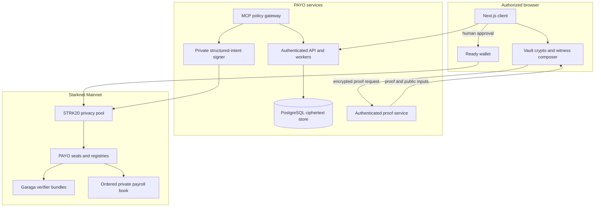
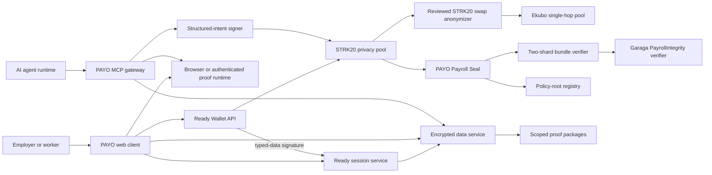
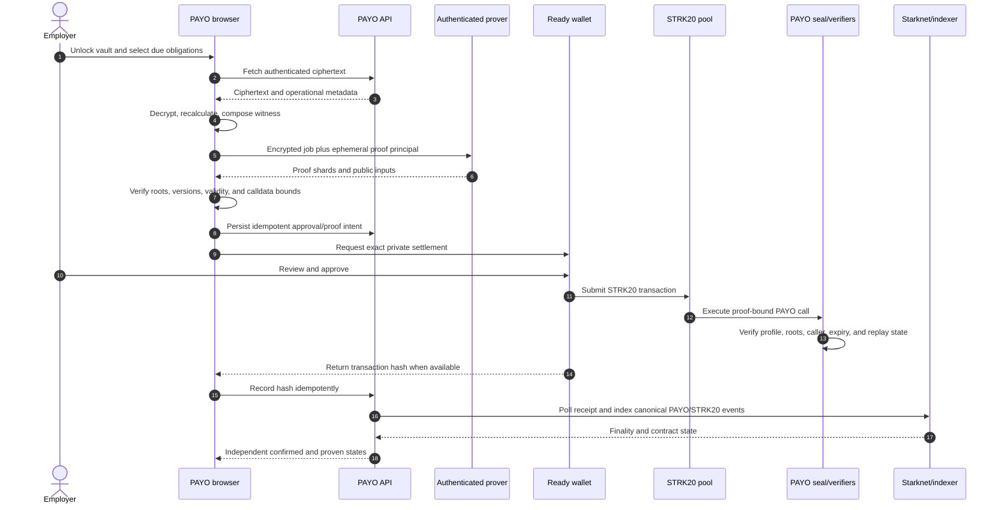
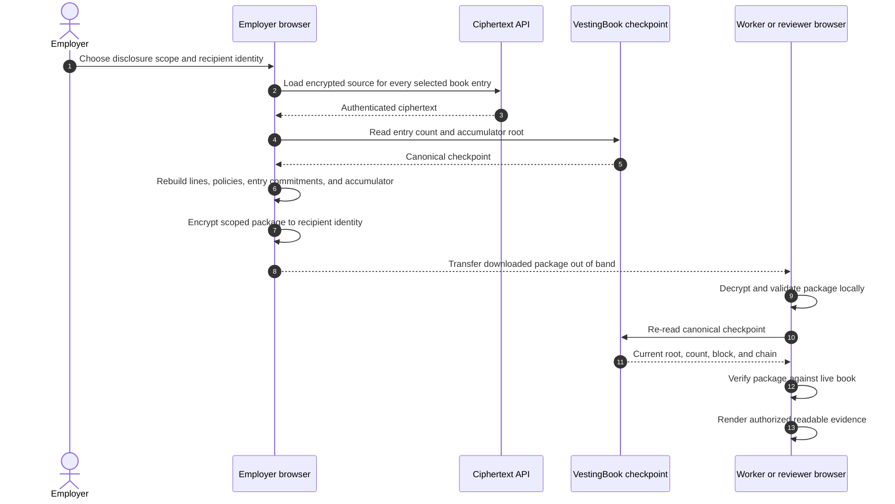
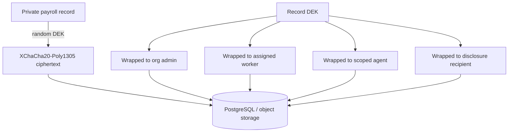
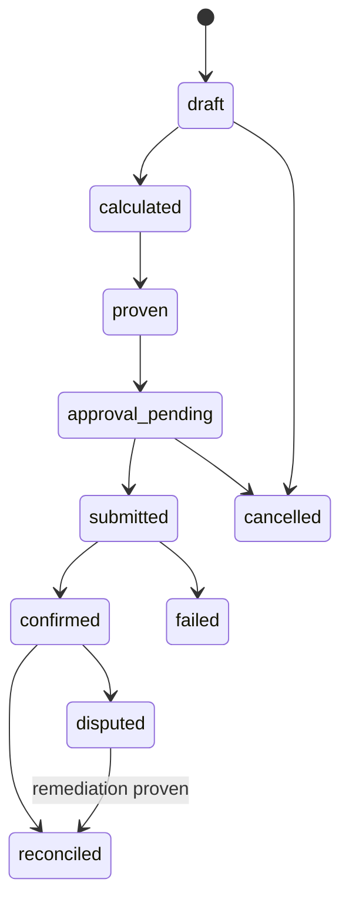

# PAYO Architecture

**Document purpose:** describe the system that exists in this repository: its runtime components, data and trust boundaries, proof semantics, deployed contract interactions, recovery behavior, and verification strategy.

This is the technical companion to the [README](./README.md). The canonical inventory of current Mainnet addresses and class hashes lives in [`docs/MAINNET_CONTRACTS.md`](./docs/MAINNET_CONTRACTS.md); measured proof and fee data lives in [`docs/MAINNET_BENCHMARKS.md`](./docs/MAINNET_BENCHMARKS.md). Selected deployment anchors are repeated here only when they explain a verified protocol boundary.

## Reader guide

| Reader | Start here |
|---|---|
| Product or hackathon reviewer | System context, trust boundaries, payroll sequence, and selective disclosure |
| Application engineer | Client-encrypted vault, domain model, state machine, failure behavior, and source map |
| Proof engineer | Commitments, PayrollIntegrity, SettlementMatch, and verification strategy |
| Starknet engineer | Token model, contracts, registries, vesting book, and private exit boundary |
| Operator or security reviewer | Runtime deployment, trust boundaries, recovery, MCP signing boundary, and failure behavior |

The architecture uses four kinds of evidence deliberately:

- **Source invariant:** enforced by application, circuit, or contract code.
- **Test evidence:** reproduced locally, in CI, or on Devnet.
- **Deployment evidence:** address, class, configuration, or receipt read back from Mainnet.
- **User assertion:** useful operational input that is never promoted to cryptographic or chain evidence.

## Architecture at a glance



The browser is the plaintext workspace for stored payroll data. PostgreSQL retains authenticated ciphertext plus the minimum operational metadata needed for authorization, scheduling, retries, and chain recovery. The hosted prover is a separate, authenticated trust boundary: it receives an encrypted job plus an ephemeral decryption principal and opens the witness in volatile job memory. A deployment that cannot accept that transient trust must run the prover under its own control.

## 1. Design principles

1. **Non-custodial settlement.** PAYO contracts never hold the payroll treasury. STRK20 owns private note settlement and users authorize transactions from their own accounts.
2. **Encrypted before storage.** Sensitive payroll fields leave an authorized client only as authenticated ciphertext.
3. **Proof states are specific.** A calculation proof, a Starknet receipt, and a settlement-reconciliation proof are different evidence.
4. **Private does not mean unaccountable.** Every private run has a scoped receipt path for the employer, each worker, and explicitly authorized reviewers.
5. **Agents receive capabilities, not treasury keys.** An MCP client cannot request arbitrary signing.
6. **No silent downgrade.** Unsupported tokens, proof versions, wallet APIs, and policy roots fail closed with an explicit state.

## 2. System context



### Component responsibilities

| Component | Responsibility | Must not do |
|---|---|---|
| Web client | Decrypt, calculate, prove, compose wallet actions | Upload plaintext payroll |
| Ready | Hold human STRK20 keys and request approval | Reveal a recovery phrase or viewing key to PAYO |
| Ready session service | Verify domain-separated account signatures and issue revocable tenant sessions | Treat an authentication signature as transaction authority or store bearer tokens in plaintext |
| Encrypted data service | Authorize tenants and store ciphertext/workflow metadata | Decrypt sensitive records |
| Proof runtime | Generate PayrollIntegrity, advanced-obligation, vesting, claim, remediation, and SettlementMatch proofs | Persist or log private witnesses |
| MCP gateway | Offer structured payroll tools and redact responses | Expose arbitrary calls or keys |
| Structured-intent signer | Rebuild and validate permitted agent actions | Sign caller-supplied arbitrary calldata |
| STRK20 | Private notes, channels, proving, and settlement | Enforce PAYO employment policy |
| Payroll Seal | Verify proof state and prevent replay | Custody payroll assets |
| Bundle verifier | Verify both linked shards with one proof-bound Garaga verifier | Accept a missing, duplicated, or reordered shard |
| Private-exit adapter | Validate a canonical Ekubo quote and build the reviewed STRK20 anonymizer call | Call arbitrary routers, pools, bridges, exchanges, or label public withdrawal private |

### Runtime deployment

The repository defines five deployable services and one durable store. Public exposure is minimized by role:

| Component | Network boundary | Sensitive material handled | Fail-closed condition |
|---|---|---|---|
| Browser client | User device | Decrypted vault records, Ready approvals, report plaintext | Locked vault, wrong identity, stale chain binding, or unsupported wallet |
| `private-payroll` | Public HTTPS | Ciphertext, session-token hashes, workflow metadata, transaction references | Invalid session, tenant mismatch, unavailable database, or mismatched deployment config |
| `private-payroll-prover` | Authenticated HTTPS with origin allowlist | One proof witness in volatile job memory | Disabled runtime, invalid session, wrong tenant, oversized request, or full queue |
| `payo-privacy-discovery` | Fly private network | Public/block-pinned STRK20 index data | Stale index, wrong chain, or unavailable service |
| `payo-transaction-prover` | Fly private network | Transaction-OS proving state for direct SDK execution | Unpinned build, invalid request, or unavailable service |
| `payo-policy-signer` | Fly private network only | Policy-account owner key and signer HMAC | Wrong caller, replay, noncanonical envelope, unknown method, or policy mismatch |
| PostgreSQL | Private database network | Authenticated ciphertext, operational metadata, leases, cursors, and token hashes | Unavailable migration, tenant mismatch, revision conflict, or failed transaction |

The web release runs schema migration before activation. Health checks cover service availability; correctness still depends on the application, proof, chain read-back, and evidence gates described below. Secrets are server-side only and must never use a `NEXT_PUBLIC_` name.

### Proof-to-settlement pipeline

```mermaid
flowchart LR
    A[Encrypted agreements] --> B[Select exact due set]
    B --> C[Recalculate and build private witness]
    C --> D[Encrypt idempotent proof job]
    D --> E[Generate linked Noir proof shards]
    E --> F[Validate public inputs and calldata bounds]
    F --> G[Persist durable approval intent]
    G --> H[Ready review and signature]
    H --> I[STRK20 private settlement]
    I --> J[PAYO seal and Garaga verification]
    J --> K[Finality plus canonical event indexing]
    K --> L[Encrypted receipt and payroll-book source]
    L --> M[Scoped employer, worker, or reviewer evidence]

    D -. same request ID .-> R[Resume queued proof]
    H -. hash callback missing .-> S[Bounded event recovery]
    S --> K
    J -. invalid proof, root, expiry, or replay .-> X[Reject without verified state]
```



Stages A through F handle private payroll data and proof construction. Mainnet receives only the proof statement, commitments, validity data, nullifiers, and the private STRK20 call. Stages K through M preserve transaction evidence and encrypted source material so a later disclosure can reproduce the selected onchain book without trusting a screenshot or manually entered summary.

### Human private-payroll sequence



If Ready confirms a transaction but its callback does not return the hash, the durable intent remains pending. The recovery worker searches only the bounded canonical window for an event matching the exact account, pool, seal, roots, nullifier, and request context. It records one unique match and never asks the user to pay again merely because a callback timed out.

### Compliance-disclosure sequence



Employer and authorized-tax-reviewer packages cover the complete selected book. Worker packages contain only that worker's lines and the checkpoint needed to verify them. A readable export is a deliberate privacy exit and is treated as sensitive.

### Source-to-runtime map

| Source area | Runtime responsibility |
|---|---|
| `app/` | Product routes, API endpoints, authentication entry points, and wallet UX |
| `lib/client/` | Local decryption, agreement selection, witness construction, proof orchestration, disclosure, and recovery |
| `lib/domain/` | Versioned schemas, exact arithmetic, canonical commitments, and state transitions |
| `lib/persistence/` | Tenant-scoped repositories, PostgreSQL transactions, idempotency, leases, and chain cursors |
| `lib/proof/` | Proof worker protocol, hosted proving, public-input checks, and verifier calldata |
| `lib/starknet/` | Ready/STRK20 adapters, RPC read-back, contract bindings, quotes, and transaction recovery |
| `circuits/` | Noir statements, fixtures, verification keys, and proof artifacts |
| `contracts/` | Cairo seals, registries, verifier bundles, generated verifiers, and integration harnesses |
| `packages/mcp/` | Structured tools and capability-constrained agent surface |
| `scripts/` | Migrations, background workers, artifact reproduction, deployment planning, and evidence verification |


## 3. Trust and leakage boundaries

The boundaries below distinguish public-chain and persistent-service exposure. An authorized browser necessarily sees the records it decrypts, and the configured hosted prover transiently sees a witness while generating its proof.

### Hidden by design

- worker and agent identity;
- recipient Starknet address;
- salary, deductions, benefits, severance, and token preference;
- agreement type, jurisdiction, and classification evidence;
- individual schedule and vesting parameters;
- plaintext accounting exports.

### Public or observable

- transaction submitter unless a paymaster/relay hides it;
- interaction with the STRK20 pool and PAYO contract;
- transaction timing and calldata size;
- verifier and policy-catalog versions;
- commitment roots, run nullifier, and proof status;
- explicitly disclosed aggregate values; and
- for a private Ekubo swap, the anonymous amount, pool route, timing, and calldata size.

Commitments do not make low-entropy values secret by themselves. Every sensitive leaf includes a cryptographically random 32-byte salt before hashing.

## 4. Client-encrypted vault

### Ready-authenticated access

The connected Mainnet Ready account is the human authentication root. PAYO issues
a one-time five-minute typed-data challenge bound to the wallet address, Mainnet
chain ID, deployment audience, nonce, issue time, and expiry. The server verifies
the account-contract signature on Starknet, consumes the challenge atomically,
and stores only the SHA-256 hash of the resulting revocable bearer token. Sessions
expire after 12 hours by default. An authentication signature cannot shield funds,
change a registry, or approve payroll; each such action remains a separate Ready
request.

Wallet addresses normally derive a new PAYO principal. To preserve encrypted
workspaces created under the former identity system, PAYO may link one Ready
address to an existing principal only through vault recovery. The server encrypts
a random, expiring challenge to the existing member's X25519 public key; the
browser decrypts it with the password-protected recovery package and returns the
challenge. Successful completion is single-use, revokes the pre-link sessions,
and issues a session mapped to the existing principal. PAYO never receives the
recovery password, X25519 secret key, organization secret, or decrypted records.

Each sensitive record receives a random 256-bit data-encryption key (DEK). The record is encrypted with XChaCha20-Poly1305 and the DEK is sealed independently to each authorized X25519 principal.



Associated data binds `schema_version`, `organization_id`, `record_type`, `record_id`, and `revision`. Moving ciphertext between tenants or revisions therefore fails authentication.

The service may see operational metadata needed to schedule and synchronize work: tenant ID, opaque record ID, revision, encrypted payload size, state, due timestamp, roots, and transaction references. It must never receive a plaintext pay line.

### Recovery

Vault creation produces an encrypted recovery package. An organization must either download it or wrap the organization key to a second administrator before production use. PAYO cannot reset a lost vault key.

## 5. Domain model

### Primary records

- `Organization`: tenant configuration, vault public keys, supported token policy.
- `Principal`: human, worker, agent, auditor, or signer identity.
- `Payee`: encrypted identity and payout details.
- `PayAgreement`: encrypted obligation terms and policy references.
- `PolicyPack`: public versioned rules plus a commitment included in a catalog root.
- `PayrollRun`: cycle, encrypted manifest, roots, proof and settlement states.
- `PayrollLine`: encrypted private witness for one agreement obligation.
- `ProofBundle`: proof bytes, public inputs, verifier version, and verification receipt.
- `Settlement`: wallet request ID, transaction hash, confirmation, note-evidence state.
- `DisclosureGrant`: field scope, recipient encryption key, expiry, and revocation.
- `AgentCapability`: signed structured authority for MCP execution.
- `AuditEvent`: append-only operational evidence without private field values.

Use UUIDv7 identifiers offchain. Amounts are base-10 atomic-unit strings and are never JavaScript floating-point numbers.

### Payroll state machine



- `proven` means PayrollIntegrity verified.
- `confirmed` means Starknet accepted the STRK20 transaction.
- `reconciled` means SettlementMatch verified or an explicitly labeled authorized disclosure reconciled the notes.

## 6. Token model

| Token | Mainnet address | Decimals | Fee behavior |
|---|---|---:|---|
| STRK | `0x04718f5a0fc34cc1af16a1cdee98ffb20c31f5cd61d6ab07201858f4287c938d` | 18 | PAYO reads the pool fee passively; Ready constructs and deducts the final private fee when it submits the Wallet API request |
| Native USDC | `0x033068f6539f8e6e6b131e6b2b814e6c34a5224bc66947c47dab9dfee93b35fb` | 6 | PAYO converts the live pool fee using the paymaster's current token price and an explicit conservative buffer; Ready constructs the final deduction |

Native USDC is enabled because the live Ready/pool compatibility test and its on-chain evidence pass. The application never substitutes bridged USDC silently.

A payroll may mix STRK and USDC lines. Treasury validation groups totals and passive fee reserves by token and fails closed if any active token lacks sufficient shielded balance. PAYO does not call `wallet_strk20PrepareInvoke` merely to preview a fee before later calling `wallet_strk20InvokeTransaction`; that created a second wallet request without producing a submittable transaction. The final Wallet API request remains responsible for constructing and submitting the private transaction. Receipt-reported Starknet gas and Ready's token-denominated privacy-fee recovery are separate evidence and must not be collapsed into one guessed public-STRK debit.

### Private exit boundary

PAYO integrates the existing STRK20 `EkuboSwapAnonymizer`; it does not implement
an exchange. The production route is deliberately narrow: Mainnet STRK/USDC,
Ekubo's pinned router, one extension-free single-hop pool, no split, and no
`skip_ahead`. The server accepts only an exact-input quote from Ekubo's official
quoter, rereads its block hash from Starknet, rejects a quote more than 20 blocks
behind, and commits the complete route for 45 seconds. It verifies the configured
executor's class hash both at readiness and at the quoted block. The browser
rechecks that class before it is permitted to open Ready.

The Wallet API action order is one input-token withdrawal to the anonymizer, one
`OPEN` output note to the connected private account, and one invocation whose
open-note identifier is supplied by Ready. The reviewed anonymizer enforces a
positive full-fill swap, minimum received, matching pool tokens, nonzero output,
and return of the output asset to that open note. Input amount plus the live
token-specific STRK20 fee reserve must be available before submission.

This route keeps the user's source account and resulting encrypted note shielded,
but it does not conceal the anonymous swap amount or
Ekubo pool route from the external protocol. A direct STRK20 withdrawal is a
separate, explicitly acknowledged public exit: destination, token, amount, timing
and transaction become linkable. Bridges, centralized exchanges and arbitrary
contract calls are blocked rather than described as private. The immutable Mainnet
instance at `0x6737a6cdde0e0c4f39d88ec7301e1db8d7c46ffed35ade0ee9a56ed87ab784` was deployed in
`0x1245b90664a6d2144b04d9aedeb8e1d6822b6a6ea88e5d45b0024400e32c698` and independently read back with the exact reviewed class hash. A
runtime remains disabled when that address is absent or its class differs. Invoke
addresses are normalized to canonical Starknet felt strings before the Wallet API
request; this prevents Ready from rejecting padded-address calldata before signing.
The signed live canary confirmed 0.2 USDC into a 6.481607 STRK private note, with a
6.41679 STRK minimum and the anonymizer verified at block 14,504,583.

## 7. Commitments and nullifiers

Externally disclosed v1 identity, policy-ID, receipt, and nullifier commitments use canonical byte encoding and Keccak-256. PayrollIntegrity additionally derives circuit-internal agreement leaves, payroll leaves, and fixed-tree nodes with a domain-separated BN254 Poseidon2 sponge. This proof-root layer is reproduced byte-for-byte by the browser input builder and exists to keep the 64-leaf circuit provable with the Starknet-compatible backend; it never replaces a disclosed v1 commitment silently.

```text
leaf = keccak256(
  "PAYO_LEAF_V1" ||
  schema_version ||
  keccak256("PAYO_AGREEMENT_ID_V1" || agreement_id) ||
  recipient_commitment ||
  gross_atomic ||
  deductions_commitment ||
  net_atomic ||
  token_address ||
  policy_commitment ||
  schedule_commitment ||
  salt_32
)
```

Both proof trees are fixed at 64 leaves and permit no more than 50 real leaves. Circuit-internal empty leaves use a versioned Poseidon2 constant. A canonical Keccak run nullifier prevents replay:

```text
run_nullifier = keccak256(
  "PAYO_RUN_V1" || organization_secret || cycle_id || revision
)
```

Hash and proof-root values crossing into Cairo are represented as two big-endian `u128` limbs. Keccak commitment vectors remain mandatory for TypeScript, Noir, and Cairo; proof-root Poseidon2 vectors are mandatory for TypeScript and Noir because Cairo consumes, but does not recompute, those roots.

## 8. PayrollIntegrity proof

### Public inputs

PAYO has two deployment-bound payroll profiles. `v1` proves the base calculator. `v2` is one merged circuit that retains every v1 policy, FX, completeness, classification, final-pay, and nullifier constraint and additionally proves the committed advanced payment plan. Each profile uses two linked shards against one profile-specific circuit and verification key. Every shard exposes exactly 17 fields:

- chain ID, Payroll Seal address, proof version, and schema version;
- authoritative agreement, payroll-manifest, policy-catalog, and FX-snapshot roots, each as two big-endian `u128` limbs;
- a circuit-derived run nullifier as two limbs; and
- validity start and expiry, with a maximum one-hour window; and
- a shard index, required to be `0` for the first proof and `1` for the second.

The first 16 public inputs must be identical across both proofs. Shard 0 authenticates agreement leaves 0–25 and payroll leaves 0–24; shard 1 authenticates agreement leaves 24–49 and payroll leaves 25–49. The agreement overlap binds the private global sorting boundary. `PayoPayrollSeal` accepts only the ordered 34-input bundle, so neither shard is independently sufficient to mark a run proven. A v2 shard is a single Garaga proof, not a concatenated v1+v2 envelope: the earlier 6,339-felt composite exceeded Starknet Mainnet's 5,000-felt invoke limit and is retained only as legacy parsing compatibility.

The agreement root is not a list of opaque IDs. Each leaf canonically commits the agreement ID commitment, recipient commitment, earnings components, token, compiled policy commitment, schedule, due/expiry timestamps, classification inputs, final-pay requirements, FX floor/currency, and a random agreement salt. The circuit recomputes these leaves and requires each due payroll line to equal its authoritative private terms.

### Private witness

- both fixed 64-leaf agreement and payroll arrays;
- 26 overlapping agreement witnesses and 25 payroll lines per shard;
- recipient commitments and salts;
- earnings, deductions, and net atomic amounts;
- selected token and token decimals;
- classification answers and treatment;
- schedule, milestone, vesting, or termination inputs;
- selected policy instructions and catalog paths;
- FX selection and target-value floor.

### Assertions

1. Every active due agreement appears exactly once.
2. Agreement identifiers are unique and sorted before padding; the one-to-one line mapping derives line uniqueness.
3. Earnings components sum to gross.
4. The bounded policy program produces committed deductions.
5. Net equals gross minus deductions and is non-negative.
6. Classification treatment matches the selected reference rule.
7. Token decimals and atomic conversion are exact.
8. Oracle value meets the committed reference-currency floor.
9. Schedule or vesting conditions are due at the validity timestamp.
10. Final-pay mode includes every committed offboarding component.

The first policy DSL supports `CONST`, `INPUT`, `ADD`, `SUB`, `MUL_DIV`, `MIN`, `MAX`, and fixed-size progressive `BRACKET` instructions. Packs are bounded and padded so policy complexity does not reveal the selected jurisdiction.

`ClassificationConsistency` proves internal consistency. It cannot establish legal worker status, which depends on real-world facts outside the circuit.

## 9. SettlementMatch proof

SettlementMatch is a separate proof because a correct payroll calculation does not itself prove that the corresponding private notes were transferred.

The proof consumes, privately:

- the approved manifest leaves;
- a locally controlled STRK20 viewing key;
- decrypted sent-note data;
- note/channel witnesses required to reproduce public commitments.

It exposes only the run nullifier, manifest root, transaction reference, settlement root, and proof version.

Ready does not currently expose its viewing key through the dapp Wallet API. Ready-backed payroll must therefore stop at `confirmed`, never falsely report `reconciled`, until a compatible receipt/disclosure capability exists. Direct Privacy SDK policy accounts can implement SettlementMatch because their operator controls the viewing-key provider.

## 10. Starknet contracts

### PayoPayrollSeal

The STRK20 pool calls `privacy_invoke`. The contract accepts a mode and proof payload and returns an empty `Span<OpenNoteDeposit>` because it does not custody or transform tokens.

```text
privacy_invoke(
  mode,
  proof_version,
  schema_version,
  agreement_root_high,
  agreement_root_low,
  manifest_root_high,
  manifest_root_low,
  policy_root_high,
  policy_root_low,
  fx_root_high,
  fx_root_low,
  run_nullifier_high,
  run_nullifier_low,
  validity_start,
  validity_expiry,
  shard_0_proof_calldata[]
  shard_1_proof_calldata[]
)
```

Modes:

- `PRECOMMIT`: verify PayrollIntegrity and consume the run nullifier.
- `FINALIZE`: attach SettlementMatch to an existing run.
- `CLAIM`: record a private correctness claim.
- `REMEDIATE`: bind a supplemental private settlement to a claim.

The contract verifies `get_caller_address()` equals the immutable STRK20 pool address. Replay, unknown proof versions, expired policy roots, and mismatched public inputs revert.

If proof verification cannot execute within the STRK20 invoke resource limits, `PRECOMMIT` stores a proof hash as `sealed`; a second transaction verifies it and transitions to `proven`. The intermediate state is never displayed as verified. Starknet permits at most 5,000 invoke-calldata felts; PAYO reserves eight felts for account and seal framing and rejects any raw proof above 4,992 felts before persistence or submission. The measured merged-v2 proof is 3,223 raw felts (3,231 framed) per shard.

### PayoIntegrityVerifier

Each active proof version points to a Garaga-generated, version-pinned UltraKeccakZKHonk verifier plus `PayoIntegrityBundleVerifier`. The wrapper calls that one proof-bound verifier for both shards and returns shard 0's 17 inputs followed by shard 1's 17 inputs. Version 2 points to the merged PayrollIntegrity + advanced-plan verifier; it never relies on an unsubmitted v1 companion proof. The seal requires identical deployment fields/roots, ordered shard indices, the proof-bound seal address, and the configured chain ID before it consumes the run nullifier. Generated code, proofs, calldata, and VK artifacts are reproducible build outputs. The old `PayoAdvancedBundleVerifier` remains only for historical composite-proof evidence and is not the active v2 topology.

### PayoPolicyRegistry

Stores valid policy-catalog roots and verifier versions. The hackathon Mainnet profile activates administrator-approved entries in the transaction's inclusion block, so a payroll demo never waits on a governance clock. PAYO v1 prefers new versioned deployments over an opaque proxy upgrade.

FX roots use a separate freshness-safe path. Policy roots, verifier versions, obligation roots, and FX-publisher rotation activate immediately after confirmation; expiry and explicit revocation remain enforced. This deliberately makes the registry administrator a visible hackathon trust boundary, so the deployment account must remain a multisig or tightly controlled account. The currently authorized limited-purpose publisher may register an FX root only for the observation's remaining lifetime, capped at one hour, and never controls payroll funds. Before the publisher spends gas, the backend checks both linked proof shards with the registered on-chain verifier at one pinned block and requires their public inputs to bind the exact deployment, proof version, FX root, validity window, and shard order. An authenticated, expiring ticket additionally binds the Pragma snapshot catalog to one tenant and principal. A production-governance release should use separately deployed timelocked registries.

### Tenant obligation-root ownership

An obligation root is scheduled by the Ready account operating the organization. The first scheduling account becomes that root's owner; only it may refresh or transfer the root. The protocol administrator cannot schedule or transfer tenant roots and retains only an explicit emergency-revocation power. The browser reads the owner before proof generation and again after confirmation, so one organization's wallet cannot silently reuse another organization's active commitment. Tenant membership also gates hosted proof generation; there is no singleton prover-principal allowlist.

## 11. FX and policy snapshots

The initial settlement assets are STRK and USDC. An FX snapshot commits prices, base-token decimals, reference-currency quote decimals, source, timestamp, and source count for every allowlisted token/reference pair. The circuit selects the applicable pair privately. PayrollIntegrity v1 uses six-decimal USD/GBP reference values and fails closed on any other quote scale.

The production protected profile reads Pragma's source-aggregated median and
Summary Stats TWAP at one pinned Starknet block. On Mainnet, `STRK/USD` uses a
24-hour TWAP, a 15-minute maximum median age, at least three sources, the lower
of median/TWAP, and a one-percent haircut. `USDC/USD` median data remains usable
for ordinary payroll, but its protected `FXFloor` profile fails closed because
the Mainnet Summary Stats contract currently has no usable USDC/USD TWAP
checkpoint history. PAYO never fabricates or substitutes a stablecoin TWAP.

The adapter enforces:

- a maximum age;
- a minimum source count when supplied by the feed;
- a configurable conservative haircut;
- an explicit unsupported-pair state.

US, UK and Canadian packs are versioned reference implementations. They demonstrate verifiable calculations and review triggers; they are not maintained legal advice.

## 12. Payment plans and claims

- **Batch:** one private run with up to 50 recipients.
- **Recurring:** the scheduler prepares a due draft; Ready still requires human approval.
- **Checkpoint stream:** value accrues continuously but settles at explicit checkpoints.
- **Milestone:** a committed approver attestation makes an obligation due.
- **Vesting:** the private schedule is committed and the proof checks release eligibility.
- **Final pay:** termination terms activate ordinary, leave, notice, severance, and adjustment components.

The scheduler stores only tenant ID, opaque agreement ID, revision, due time,
and schedule commitment. Registration is authenticated, revision-bound to the
current encrypted vault record, serialized per agreement, and idempotent.
Concurrent durable workers materialize due rows with row leases/locks; the
Payroll client decrypts the matching agreement locally, rechecks eligibility,
and prepares the draft. A materialized row never authorizes payment: Ready
still requires human approval and the PAYO proof still enforces the committed
schedule.

In this document, an STRK20 `Channel` is the Privacy SDK's encrypted sender-to-
recipient context with token-specific nonce subchannels. It is not an escrow or
continuous-value payment channel. Direct SDK execution uses channel discovery,
`autoSetup`, and token-subchannel readiness; Ready performs the equivalent
channel lifecycle internally for Wallet API transfers. Every checkpoint,
milestone, vesting, or recurring settlement is an actual private note transfer
through that context.

A worker claim uses a separate proof mode to show that an obligation is absent or below its committed floor without revealing the expected amount. A remediation payment references the claim nullifier.

### Stateful VestingBook v3

A finalized book entry is authorized by four ordered proofs: the two active v2
PayrollIntegrity shards and two v3 VestingTransition shards. The v3 public statement
binds the v2 agreement root, manifest root and run nullifier to an entry kind, payer,
vesting schedule, previous and next state, one release nullifier, reporting period,
book-entry commitment, deployment, chain and validity window. An ordinary payroll
book append uses entry kind `0` and zero vesting fields; stateful vesting uses entry
kind `1`.

The private v3 witness opens exactly one authoritative agreement. For vesting it
recomputes the salted schedule identifier from recipient, token, total, start, cliff
and end; checks the immutable committed plan; calculates linear accrual at the release
time; proves the payable value is exactly `vested - already_released`; increments the
release sequence; and derives the next-state and release-nullifier commitments. Before
the cliff the accrued amount is zero, after the end it is capped at the committed
total, and a zero or changed release cannot pass.

`PayoVestingBookSeal` reloads both active verifier versions and the tenant-owned
obligation root, checks all four calldata hashes and public-input bindings, and only
accepts its immutable STRK20 pool as the final caller. Finalization consumes the run
and release nullifiers, requires the stored schedule state to equal the proved old
state (or a unique zero-state genesis), writes the next state, and atomically appends
the book entry. The ordered period accumulator is
`Poseidon(PAYO_BOOK_ADD_V1, previous_root, entry_high, entry_low, index)`; entries and
state are commitments, never public salary plaintext.

The reviewed Mainnet v3 topology is deployed and active: the generated verifier is
`0x4b35d2d366848169ea4fb32d4fffda498b5251160da2e60fc53030a37d5551c`,
the ordered bundle is
`0x1bc7517191802bf82ccfb60fa4f27f9306d6cfee9160b545d7dea662e8870a8`,
and the VestingBook seal is
`0x5208cc07cb4153235ab5c6ecd1936ee77f9be7a2ea09f6cc69518a6362493f`.
Deployment class hashes, immutable dependency wiring, the active proof-version-3
profile, the real ordered proof pair and reversed-shard rejection were read back in
`evidence/vesting-tax-mainnet.json`. The approved live canary transaction
`0x06aea439656addfd17b315879696f0ace3880d9878ec01221033ee367d0deaf1`
succeeded at block `14461163`. Read-back confirmed its exact next state, consumed
release nullifier, entry at index 2 of 3 and recomputed complete period accumulator.
The compact verifier input is retained in
`evidence/vesting-tax-mainnet-canary-2026-09-06.json`.

The production web and prover machines both pin that exact seal in public build-time
and private server runtime configuration. The served payroll bundle exposes the same
address and fails closed for advanced runs when it is absent; the protected prover
route remains enabled and authentication-gated. Release image identifiers, health
checks and the green source CI binding are recorded in
`evidence/vesting-tax-hosted-rollout.json`. The original Ready callback required
manual transaction-hash recovery after the live payment. Commit `ffdd3a1` deploys
exact dual-seal event recovery, completed-v3 authorization recognition and idempotent
encrypted vesting-state advancement; the recovery path is regression-tested but has
not consumed funds for a second live canary.

### Complete private compliance book

For every on-chain book entry, the organization retains an authenticated encrypted
source record. A complete employer or tax-authority export must open exactly one
source for every ordered on-chain entry, rebuild the original PayrollIntegrity inputs,
recompute statutory deductions and classification treatment, verify transaction
bindings, recompute every entry commitment and reproduce the trusted accumulator.
Missing, duplicated, changed, cross-tenant or extra evidence fails closed. A worker
statement is derived only after that complete-book check and contains only the selected
worker's lines plus the checkpoint needed for verification.

Reports are X25519-recipient encrypted. Import, decryption and integrity checking occur
locally in Activity, which rereads the live VestingBook checkpoint before showing a
verified result. Employer scope exposes the complete payroll book to the payer; tax
scope exposes the same complete book only to the chosen tax reviewer; worker scope
exposes only that worker's income statement. The W-2/P60/T4-style rendering is a
readable cryptographic report, not an official government filing or legal/tax advice.

Every readable view is derived from `payo-verified-income-evidence-v1`; formats do not
run their own arithmetic. Each canonical line contains its ordered book/line index,
recipient binding, worker type, token-denominated gross, deductions and net, both
proof/settlement transaction bindings, and the exact policy ID, revision, program
commitment and catalog root. The evidence also commits the complete independently read
checkpoint and states whether it covers the entire book or one worker's opened lines.
It can be constructed only after the encrypted report reconstructs that checkpoint.

The report carries every exact versioned policy pack used by each entry. PAYO
recomputes the policy catalog root, requires it to equal the PayrollIntegrity policy
root, and requires each line's complete canonical policy to match a catalog member.
Changing a rule, revision, source, effective window or instruction therefore fails as
policy substitution even when the policy ID is unchanged. The initial source-pinned
examples cover a narrow US supplemental-wage method, UK monthly category-A employee
NI and a narrow Canadian small irregular-payment method. Each remains review-gated
and lists assumptions and unsupported cases.

Employee lines in the supported jurisdictions can then be rendered locally as
W-2-style (Box 1/Box 2), P60-style (total pay/bound deductions), or T4-style (Box
14/Box 22) evidence. Amounts stay denominated in the privately paid token and every
view commits its source evidence, policy bindings and book root. Contractor and agent
lines are never relabelled as employee forms. A plaintext readable download is an
explicit privacy exit and is labelled sensitive; PAYO does not claim government
e-filing, certification, legal sufficiency or official-form equivalence.

A direct STRK20 holder derives a reporting-only X25519 key with domain-separated
HKDF from their local viewing key and exports only the X25519 public key, derived
Stark public key, deployment/recipient context and a Stark-ECDSA ownership proof.
The viewing key is cleared from the form and is never exported. The employer first
verifies the complete book, then encrypts a recipient-only statement source to that
identity. The worker opens that source locally, rereads the public on-chain checkpoint,
chooses the final report identity/time and self-encrypts the verified statement. A
wrong key, forged ownership proof, changed recipient, omitted line, altered entry or
stale checkpoint fails closed. Because Ready does not expose its STRK20 viewing key,
Ready users are labelled explicitly as a PAYO-X25519 fallback and are never described
as viewing-key-derived.

The reproducible real-proof composition gate is in `contracts/vesting_integration`.
Standalone topology, state transition, ordered-accumulator, changed-proof, replay and
stale-genesis evidence is in `evidence/vesting-tax-devnet.json`; its lifecycle harness
is test-only and is never part of a production deployment.

### Private external fact attestations

`payo-external-attestation-package-v1` binds one exact advanced agreement to a
six-level catalog opening. Its domain-separated signed commitment covers the issuer's
Ed25519 public key, the agreement recipient commitment, residency/employment/tax fact
mask, jurisdiction commitment, active status, validity window, unique nonce and the
exact PayrollIntegrity policy root. The browser verifies the signature and reconstructs
the catalog root before it encrypts any prover witness; the current composer accepts
one package for one selected advanced agreement so subject selection is unambiguous.

The v3 circuit independently recomputes that commitment, proves its fixed-tree
membership, requires all three facts and active/nonzero fields, binds the subject to
the authenticated agreement leaf and requires the credential to cover the complete
one-hour proof window. Only the catalog root enters public inputs and the payroll-book
entry. `PayoVestingBookSeal` reads that root back from both verified shards and accepts
it only while the existing versioned policy registry reports it active. A changed
subject, policy root, fact mask, validity value, membership path or public root fails
closed; revoking the catalog root prevents new authorizations.

Ed25519 verification is deliberately outside the Noir/Cairo verifier. Approved issuer
keys and revoked nonces are checked while constructing the catalog, and the registry
administrator authorizes only that already-verified root. This administrator is the
explicit issuer trust boundary: an individual nonce revocation requires publishing a
replacement catalog and revoking the previous root. PAYO never claims that Starknet
natively verified the issuer signature or publishes the credential contents.
The combined STRK20 SDK evidence in
`evidence/universal-payroll-book-private-devnet.json` additionally records one atomic
private agent payment, exact recipient balance delta, SettlementMatch verification,
single book append and replay rejection. Its v2/v3 public-input authorization harness
is test-only; `contracts/vesting_integration` separately proves the same production
seal composition against the real generated v3 verifier.

## 13. Selective disclosure

A `PayrollProofPackage` is an encrypted bundle containing only the grantee's selected fields:

```text
manifest.json
journal.csv
proof.json
verification.json
starknet-receipt.json
```

Worker receipts include one line opening and its Merkle path. Employer books include the full authorized manifest. Auditor packages can reveal aggregates, deductions, or selected workers without granting ongoing vault access.

## 14. MCP and bounded agent execution

### Tools

- `payo_get_capability`
- `payo_list_due_obligations`
- `payo_draft_run`
- `payo_validate_run`
- `payo_request_execution`
- `payo_get_run_status`
- `payo_get_receipt`
- `payo_create_disclosure`

### Capability fields

```text
capability_id
organization_id
principal_id
allowed_actions[]
allowed_tokens[]
recipient_scope
purpose_codes[]
max_per_payment
max_per_period
valid_after
expires_at
approval_threshold
nonce
```

The MCP boundary accepts only a structured `PaymentIntent`. The execution
gateway reloads its tenant, capability, run and proof records from PostgreSQL,
reserves limits transactionally, reconstructs the exact STRK20 actions, proves,
simulates and recovers idempotently. MCP callers never supply hashes, calldata,
calls, targets, proofs, signer methods or private keys.

One policy-account address owns one durable encrypted private-treasury state and
viewing key. Short-lived capability records contain only their own session key
and proof principal; they share neither divergent note registries nor parallel
spend leases. The one global treasury lease serializes proof generation,
private-note selection, submission and final state advancement across every
capability for that address.

STRK20 proof invocations require the policy account's owner signature, while
SNIP-9 execution uses the capability's short-lived session signature. Those are
separate trust domains:

- `payo-policy-signer` alone holds the owner key and has no public Fly service;
- web/worker authenticate with a replay-protected HMAC but never receive that key;
- the signer accepts only the canonical zero-fee, no-paymaster, one-call
  `compile_actions` envelope for the pinned chain, pool, treasury and registered
  viewing key, or one bounded `configure_policy` self-call;
- message, declare, deploy, rotation, pause, revocation and arbitrary-call
  signing methods fail closed;
- the fee relayer has a different role and cannot satisfy owner validation;
- the session key signs only the time-bounded `execute_from_outside_v2` call,
  after which the policy account re-parses pool actions, limits and PAYO roots
  onchain before settlement.

Activation is a pinned read-back, not a configuration claim: class hash, owner,
policy fields, active state and STRK20 registration key must all match. Missing
registration is not reported as zero balance. Policy configuration and owner
recovery additionally require a small public-STRK gas budget on the policy
account; private payroll principal remains in STRK20 notes.

Human approval remains the default. Autonomous execution is enabled per
capability only after contract, isolated-signer, database and adversarial MCP
tests plus an explicitly approved live canary pass.

## 15. Failure behavior

| Failure | Required behavior |
|---|---|
| Ready missing or old Wallet API | Show unsupported state; do not attempt a private request |
| STRK20 registration missing | Link setup flow; do not label as zero balance |
| Isolated owner signer unavailable or mismatched | Stop before proof generation; never fall back to the session or fee-relayer key |
| Policy account lacks public owner-operation gas | Block configuration/rotation and show the simulated requirement; do not consume a capability reservation |
| USDC pool support missing | Disable USDC; do not substitute another token |
| Fee or public balance unavailable | Disable shielding and offer explicit retry |
| Wallet rejection | Preserve the pre-wallet durable approval intent, mark it cancelled only after the operator confirms Ready submitted no transaction, and return the obligation schedule to a retryable state; never record a transaction hash that does not exist |
| Submitted hash times out | Persist hash and resume confirmation polling |
| Chain reorg | Move confirmation back to submitted until final again |
| Proof invalid | Reject before wallet approval |
| Proof version revoked | Require a newly generated proof |
| Duplicate run nullifier | Treat as replay/idempotent conflict |
| Lost vault key | Recover only from the organization recovery package or another authorized principal |
| Ready session expires | Keep any returned transaction hash in local recovery state; re-authorize Ready and resume idempotent recording without resubmitting payroll |
| Replayed authentication or recovery challenge | Reject atomically; challenges are single-use and attempt-limited |
| Agent capability exceeded | Reject before signing and append a redacted audit event |
| Private swap quote expired, changed, split, stale, or bound to another route/class | Reject before opening Ready and require a fresh canonical quote |
| Public or unsupported exit selected | Require explicit permanent-disclosure acknowledgement for a direct withdrawal; block bridges, exchanges and arbitrary calls |

## 16. Verification strategy

- TypeScript/Noir/Cairo commitment golden vectors.
- Circuit negative tests for omission, duplication, wrong arithmetic, stale FX, early vesting, incomplete final pay, invalid shard indices, and shard/witness mismatches.
- Native and application-runtime proof self-verification for both linked shards, a hard Mainnet calldata-size gate, and real Cairo verification of each proof.
- An uninterrupted real-proof → Garaga verifier → bundle verifier → Payroll Seal integration test; mocks do not satisfy this gate.
- Cairo unit and fuzz tests for caller validation, replay, versioning, and state transitions.
- Encryption tests for tenant isolation, associated-data tampering, revocation, and disclosure scope.
- MCP adversarial tests for prompt injection, arbitrary targets, replay, and period-limit bypass.
- Wallet integration tests for rejection, repeated requests, confirmation recovery, and balance refresh.
- Private-exit tests for quote commitment/expiry, canonical block and class binding, route substitution, fee reserve, rendered disclosure, and the upstream STRK20 open-note composition.
- Mainnet smoke tests with deliberately small STRK and USDC values.

A capability is described as working only after its relevant artifact builds, its negative tests pass, and its evidence is linked from the repository.
